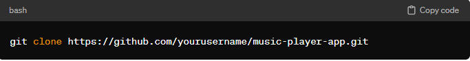
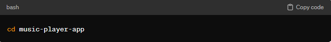

# Music Player App
👉<b>Overview</b> 
This project is a lightweight and intuitive music player application built using HTML, CSS, and JavaScript. It provides users with a seamless experience for listening to their favorite tracks, managing playlists, and controlling playback options. With a simple and elegant interface, this music player app is designed to be user-friendly for both casual listeners and avid music enthusiasts. 
👉<b>Features</b> 
👉<b>Play, Pause, and Skip Tracks:</b> 
Easily control playback with intuitive buttons to play, pause, and skip tracks within the playlist. 
👉<b>Volume Control:</b>  
Adjust the volume level using a responsive slider, allowing users to customize their listening experience. 
👉<b>Track Information Display:</b> 
 Display detailed information about the currently playing track, including title, artist, and album artwork, enhancing the visual experience. 
👉<b> Responsive Design:</b> 
 Ensure compatibility with various devices and screen sizes, providing a consistent user experience across desktop, tablet, and mobile platforms. 

🦾<b>Getting Started</b> 
To run the app locally on your machine, follow these simple steps: 

1️⃣<b>Clone the Repository:</b> Use Git to clone this repository to your local machine. 
 
2️⃣<b>Navigate to the Project Directory:</b> Use the command line interface to navigate to the project directory. 
 
3️⃣<b>Open <i>index.html:</i></b> Open the <i>index.html</i> file in your preferred web browser to launch the music player app. 

🎵<b>File Structure</b>🎵 
⏭<b>index.html:</b> Contains the structure and layout of the music player interface, including buttons, track information display, and volume slider. 
⏭<b>style.css:</b> Defines the styles for the music player interface, ensuring visual coherence and aesthetic appeal. 
⏭<b>script.js:</b> Implements the functionality of the music player using JavaScript, including play, pause, skip, and volume control logic. 

♾<b>Usage</b>♾
🔀<b>Play:</b?> Click the play button to start playing the current track. 
🔀<b>Pause:</b> Click the pause button to pause the currently playing track. 
🔀<b>Skip Track:</b> Click the next button to skip to the next track in the playlist. 
🔀<b>Volume Control:</b> Adjust the volume level using the volume slider to suit your preferences. 
🔀<b>Track Information:</b> View detailed information about the current track, including title, artist, and album artwork, displayed above the player controls. 

🙏🏽🙏🏽<b>Contributing</b> 
Contributions to this project are welcome! If you'd like to contribute, please follow these guidelines: 

⏺<b>Fork the Repository:</b> Fork this repository to your GitHub account. 
⏺<b>Create a New Branch:</b> Create a new branch for your feature or bug fix <b>(git checkout -b feature/new-feature).</b> 
⏺<b>Make Changes:</b> Implement your changes or additions to the codebase. 
⏺<b>Commit Your Changes:</b> Commit your changes with a descriptive commit message <b>(git commit -am 'Add new feature').</b> 
⏺<b>Push to Your Branch:</b>Push your changes to your branch on GitHub <b>(git push origin feature/new-feature).</b> 
⏺<b>Open a Pull Request:</b> Create a new Pull Request with a detailed description of your changes. 

🔴<b>License</b>🔴 
This project is licensed under the MIT License. See the LICENSE file for details. 

